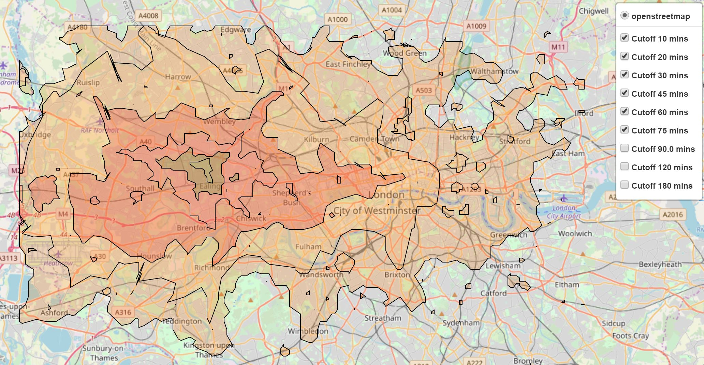

# HowFarCanIGo



Create a personalised map showing how far you can go for set distances of time using the Google API

## To use:
```
git clone https://github.com/SebStrug/HowFarCanIGo
cd /path/to/project
pip install .
python howfarcanigo/main.py
```
Windows users will have to install Shapely separately via Anaconda: `conda install Shapely`
	or by downloading the wheel here: http://www.lfd.uci.edu/~gohlke/pythonlibs/#shapely, choosing, `Shapely‑1.6.4.post1‑cp35‑cp35m‑win_amd64.whl`,
			and launching the install with `pip install Shapely‑1.6.4.post1‑cp35‑cp35m‑win_amd64.whl`

## For custom use:
Save configExample.py as config.py with custom settings.

Parameters for custom runs:
1. A Google API key
2. An origin address as a string OR a latitude and longitude
3. A travel mode: walking or transit (public transport data)
4. A local map (branching outwards from your origin), or a global map (looking at points across a space defined by your maximum and minimum coordinates).
	with corresponding minimum/maximum coordinates if using a global map
6. The number of points you want to query. Start from a small number e.g. 10, as a lattice is formed of N squared points.
    Not been tested for > 200 points.
7. Your cutoff times in minutes as a list
8. Define a custom colormap if so interested.

Enjoy!
